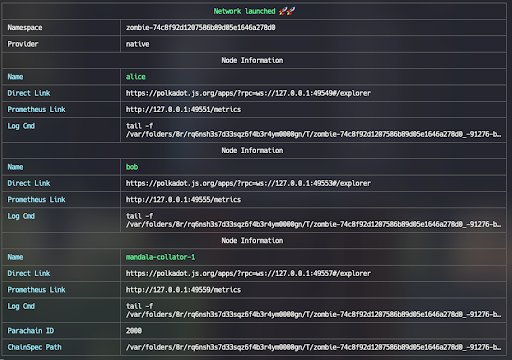

# Mandala Node Documentation

## 📘 Overview
This implementation is based on the Substrate parachain template and is part of the larger **[Polkadot SDK](https://github.com/paritytech/polkadot-sdk).** This guide will help you set up and run the Mandala Node on your system.

## Prerequisites
Before running the Mandala Node, ensure you have the Rust toolchain installed. The node is compatible with the following versions:
- **[rustup 1.27.1](https://github.com/rust-lang/rustup/releases/tag/1.27.1)**
- **[rustc 1.80.1](https://github.com/rust-lang/rust/releases/tag/1.80.1)**
- **[cargo 1.81.0](https://github.com/rust-lang/cargo/releases/tag/1.81.0)**

**Note: It is always recommended to have the latest version** of the Rust toolchain for optimal performance and security.

## Rust Toolchain Installations
In this section, we will discuss how to install the recommended Rust toolchain for the Mandala Node. Rust is the programming language used in developing the Mandala Node, and to get started, we need to ensure that `Rust` and `Cargo` are correctly **installed on our system.**

### Installation Using the Script
The recommended way to install Rust is via `rustup`, which also installs Cargo. We have provided a script that leverages `rustup` to install the correct toolchain based on your operating system.

- **Script Location:** The script can be found in the directory `.maintain/scripts/`. Other scripts are also available for different use cases (such as for running Docker, running Zombienet, etc.).

- **Making the Script Executable:** The first step is to make the script executable. Run the following command in your terminal:
    ```bash
  chmod +x .maintain/scripts/install-rust-toolchain.sh
    ```

- **Running the Script:** Next, run the script with the command:
    ```bash
  .maintain/scripts/install-rust-toolchain.sh
    ```
    This script will install the latest stable version of Rust. Once the installation is complete, your terminal will display the version of the toolchain installed. You can also specify a particular version of Rust (e.g., v1.70.0) by appending `-w 1.70.0` to the command.

### Manual Installation
To begin developing Mandala Node, it's crucial to properly install Rust and configure the Substrate development environment. The following guide provides detailed steps for installing Rust on Apple macOS computers with Apple Silicon (M-series) processors.

#### Prerequisites
Before installing Rust, ensure that your computer meets the following requirements:
- Operating system version is at least 10.7 Lion.
- Processor speed of at least 2GHz (3GHz recommended).
- Memory of at least 8 GB RAM (16 GB recommended).
- Storage of at least 10 GB available.
- Broadband Internet connection.

**Support for Apple Silicon**

Additionally, ensure that Protobuf is installed before starting the build process by running:
```bash
brew install protobuf
```
For those who prefer a manual installation method or encounter issues with the automated script, here are the steps to manually install Rust on macOS:

### Manual Installation Steps
#### 1. Installing Homebrew
If you don't have Homebrew installed, you need to install it first. Homebrew is a package manager that simplifies software installation on macOS. 
- **Open your terminal and run:**
    ```bash
    /bin/bash -c "$(curl -fsSL https://raw.githubusercontent.com/Homebrew/install/master/install.sh)"
    ```

- **Verify Homebrew Installation**
Ensure Homebrew is correctly installed by using the following command:
    ```bash
    brew --version
    ```
    This command will display output showing the installed version of Homebrew, for example:
    ```
    Homebrew 3.3.1
    Homebrew/homebrew-core (git revision c6c488fbc0f; last commit 2021-10-30)
    Homebrew/homebrew-cask (git revision 66bab33b26; last commit 2021-10-30)
    ```

#### 2. Installation Process
Since blockchain requires standard cryptography for generating public/private key pairs and validating transaction signatures, you must have a package that provides cryptography, such as `openssl`

Follow these steps to install OpenSSL and the Rust toolchain on macOS:

1. **Open the Terminal Application.**

2. **Update Homebrew:** Ensure Homebrew is up-to-date with the command:
    ```bash
    brew update
    ```

3. **Install the OpenSSL Package:** Execute the following command to install `openssl` and `cmake`:
    ```bash
    brew install openssl cmake
    ```

4. **Download and Install Rust via rustup:** Run the following command to download the rustup installation program and use it to install Rust:
    ```bash
    curl --proto '=https' --tlsv1.2 -sSf https://sh.rustup.rs | sh
    ```
5. **Follow the on-screen prompts to proceed with the default installation.**

6. **Update the Current Shell:** Add Cargo to your shell's PATH by executing:
    ```bash
    source ~/.cargo/env
    ```

7. **Verify Rust Installation:** Ensure Rust is installed correctly by checking the installed version:
    ```bash
    rustc --version
    ```

8. **Configure Rust Toolchain:** Set the default to the latest stable version with the following commands:
    ```bash
    rustup default stable
    rustup update
    rustup target add wasm32-unknown-unknown
    ```

9. **Add Nightly Release:** Add the nightly release and nightly WebAssembly (WASM) targets with:
    ```bash
    rustup update nightly
    rustup target add wasm32-unknown-unknown --toolchain nightly
    ```

10. **Verify Development Environment Configuration:** Use the following commands to ensure your development tools are configured properly:
    ```bash
    rustup show
    rustup +nightly show
    ```
    The output of these commands will display information about the active toolchains being used. Such as:
    ```
    # rustup show

    active toolchain
    ----------------

    stable-aarch64-apple-darwin (default)
    rustc 1.81.0 (eeb90cda1 2024-09-04)

    # rustup +nightly show

    active toolchain
    ----------------

    nightly-aarch64-apple-darwin (overridden by +toolchain on the command line)
    rustc 1.83.0-nightly (06bb8364a 2024-10-01)
    ```

## Running the Node
In this section, we will discuss how to run the Mandala Node for testing purposes (using Zombienet) and also for production-ready collator nodes. 

### For Testing Purposes
#### Running the Node Locally with Zombienet
##### What is Zombienet?
Zombienet is a network simulation tool designed **for developing and testing Substrate-based and Polkadot-based networks.** It allows developers to run nodes and blockchain networks locally on their computers. With Zombienet, developers can test network functionalities without needing to connect to public networks or create a distributed network.

### Using Scripts to Set Up and Launch Zombienet
To make the process of setting up and launching Zombienet easier and faster, we can use provided scripts. Here are the steps:
1. **Making the Script Executable:** First, ensure that the script is executable by running the following command in your terminal:
    ```bash
    chmod +x .maintain/download-zombienet.sh
    ```

2. **Run the Script:** Execute the script to start downloading Zombienet appropriate for your operating system:
    ```bash
    .maintain/download-zombienet.sh
    ```

3. **Prepare the Polkadot Binary:** Once Zombienet is installed, you need to **compile a Polkadot binary** and store it in the `zombienet/` directory. This binary is essential for running the network simulation by simulating the relay chain network. 
   To do this, give permission to execute this script:
    ```bash
    chmod +x .maintain/scripts/compile-mandala-polkadot.sh
    ```
   And run the script as mentioned above.

4. **Starting Zombienet:**
   
   Now, with all the parts ready, we will start the Zombienet.
   Run the command to give script permission:
    ```bash
    chmod +x .maintain/scripts/start-zombienet.sh
    ```
   And execute it with:
    ```bash
    .maintain/scripts/start-zombienet.sh dev
    ```

### Manual Set Up and Launch of Zombienet
If you prefer to do the setup and launch of Zombienet manually, you can follow these steps:
1. **Download the Zombienet Binary:** Zombienet has different versions available for various operating systems. For example, for macOS:

    - Download the binary compatible with your OS, such as the [zombienet-macos-arm64](https://github.com/paritytech/zombienet/releases/download/v1.3.110/zombienet-macos-arm64) compatible with macOS Silicon. Other binaries can be found [here](https://github.com/paritytech/zombienet/releases).

2. **Compile the Fork of the Relay Chain by Mandala:** We need to get the source code of the relay chain forked by the Mandala team on a specific branch (`mandala-polkadot-v1.11.0`). To start:
   - **Pull the Repository:** 
     ```bash
     git clone https://github.com/MandalaChain/polkadot-sdk
     ```
   - **Switch to the aforementioned branch:** 
     ```bash
     mandala-polkadot-v1.11.0
     ```

   - **Build the binaries:** 
     ```bash
     cargo build -r
     ```

     Once the build is done, these three binaries should have been built (`polkadot`, `polkadot-prepare-worker`, and `polkadot-execute-worker`). 

   - **Give execute access to these three:** 
     ```bash
     chmod +x target/release/polkadot target/release/polkadot-prepare-worker target/release/polkadot-execute-worker
     ```

   - **Then, copy all of them to zombienet directory:** 
     ```bash
     cp target/release/polkadot target/release/polkadot-prepare-worker target/release/polkadot-execute-worker zombienet/binaries
     ```

3. **Go back to the root of the project, and run:** 
   ```bash
   .maintain/scripts/start-zombienet.sh dev
   ```
   This will start the simulated network with two validator nodes for the relay chain and one collator node for the parachain.

   After you have downloaded the zombienet-macos-arm64, you will need to follow these steps to set up and launch Zombienet on macOS.

4. **Using Binaries on MacOS**
   - **Move the binary to your working directory.**

   - **Rename the Binary:** Rename the binary to just `zombienet` without any `macos-<version>` extension for convenience.

   - **Enable the binary to be executable:** You need to give the binary execute permissions. Run the following command:
       ```bash
       chmod +x ./zombienet
       ```
   - **Remove the Binary from Quarantine:** macOS may place downloaded files in quarantine for security reasons. To remove the quarantine attribute, run:
      ```bash
      xattr -d com.apple.quarantine ./zombienet
      ```

   - **Access the Binary:** You should now be able to access the binary. To verify that it is working, run:
      ```bash
      ./zombienet help
      ```
      This command will display the help information for Zombienet, confirming that the setup was successful.

5. **Install from NPM**
If you have Node.js installed, you can also install Zombienet locally via NPM. Here’s how: 
   - **Install Zombienet via NPM:**
      ```bash
      npm i @zombienet/cli -g
      ```

   - **Access the Zombienet Command:** After installation, you should be able to access the Zombienet command by running:
      ```bash
      zombienet help
      ```

6. **Status**

    At the moment, Zombienet only works with **local chains** (e.g., `rococo-local`, `polkadot-local`, etc.). This means that you can use Zombienet to simulate and test your blockchain applications in a controlled local environment without needing to connect to public networks.

8. **Configuration Files and Examples**
   
   **Spawning Networks with Zombienet**

   One of the primary goals of Zombienet is to facilitate the easy spawning of ephemeral networks. It provides a simple yet powerful command-line interface (CLI) that allows you to declare the desired network configuration in either TOML or JSON format. This flexibility enables developers to quickly set up and tear down test networks as needed.

   **Configuration File Example**

   Below is a minimal configuration example that sets up a network with two validators and one parachain. This configuration is written in TOML format.
    ```toml
    [settings]
    timeout = 1000
    
    [relaychain]
    default_command = "polkadot"
    chain = "rococo-local"
    chain_spec_path = "./plain.json"
    
    [[relaychain.nodes]]
    name = "alice"
    validator = true
    
    [[relaychain.nodes]]
    name = "bob"
    validator = true
    
    [[parachains]]
    id = 2000
    chain = "{{CHAIN}}"
    cumulus_based = true
    force_decorator = "generic-evm"
    
    [parachains.collator]
    name = "mandala-collator-1"
    command = "mandala"
    ```
    
    Then you can spawn the network by running the following command:
    ```bash
    ./zombienet-macos spawn --provider native examples/0001-small-network.toml
    ```

    **Important Notes**
   - Ensure that all required binaries (such as polkadot and mandala) are installed and accessible on your system.
   - Double-check the path to the chain specification file to ensure that the file exists and is accessible.

## Running Collator Node
### Running the Node with Docker
#### Running Docker Locally
This guide will walk you through the steps to run the Mandala Node in a Docker container. You have two options for doing this:
1. **Build a New Docker Image using the provided Dockerfile.**
2. **Use an Existing Image from Docker Hub.**

#### Prerequisites
Before you start, ensure you have the following:
- Docker Installed on Your System: Make sure Docker is installed on your computer. You can install Docker by following the official guide available **[here](https://docs.docker.com/get-docker/)**

### Option 1: Build a New Docker Image Using the Provided Dockerfile
#### Steps
1. **Build the Docker Image:** To build the Docker image, open your terminal and navigate to the Mandala project directory. At the time of writing, the image can be successfully built in an `amd64` Ubuntu instance. Then run the following command:
    ```bash
    docker build -t mandala-node .
    ```
   In this command:
   - `mandala-node` is the name of the Docker image you are creating.
   - The dot (.) at the end indicates that Docker should look for the Dockerfile in the current directory. This command will read the Dockerfile and all related files in your project directory to build the Docker image.

2. **Run the Container:** Once the image is built, you can run the Docker container with the following command:
    ```bash
    docker run -d --name mandala mandala-node:latest
    ```
   Explanation of this command:
   - `-d`: Run the container in detached mode, meaning it will run in the background.
   - `--name mandala`: Assigns the name mandala to the running container, making it easier to manage later.
   - `mandala-node:latest`: Specifies the Docker image to use for creating the container. The `latest` is the tag indicating the most recent version of the image.

### Option 2: Use an Existing Image from Docker Hub
**Note:** As explained in Option 1, the image runs on linux/amd64 platform during testing. It may not work for other platforms.

#### Steps
1. **Pull the Docker Image:** To download the latest Mandala Node Docker image, run the following command:
    ```bash
    docker pull dockerbaliola/mandala-node:latest
    ```
   This command will download the latest Docker image for Mandala Node from Docker Hub to your system.

2. **Run the Container:** Once the image is successfully pulled, you can run the Docker container with the following command:
    ```bash
    docker run -d --name mandala dockerbaliola/mandala-node:latest
    ```
   Explanation of this command:
   - `-d`: Run the container in detached mode.
   - `--name mandala`: Assigns the name mandala to the running container.
   - `mandala-node:latest`: Specifies the Docker image to use for creating the container.

### Running Docker with docker-compose
This guide will show you how to run the node using Docker Compose. Docker Compose simplifies running multi-container applications by defining all services in a single docker-compose.yml file.

#### Steps
1. **Start the Services Using Docker Compose:** With Docker and Docker Compose installed, you can start the Polkadot and Zombienet setup by running the following command from the project root:
    ```bash
    docker-compose up -d
    ```
   This command will:
   - Build the necessary Docker images.
   - Start the services defined in the docker-compose.yml file.
   - The `-d` flag will start the services in detached mode.

2. **Check Logs:** To monitor the logs from the containers, use:
    ```bash
    docker-compose logs -f
    ```
   This command will display real-time logs from all the services defined in the Docker Compose setup, allowing you track the status and activity of your containers.

3. **Stop the Services:** To stop the running containers, run:
    ```bash
    docker-compose down
    ```
   This command will gracefully stop and remove the containers, but the data (volumes) will remain intact. This means that any data stored in volumes will not be lost when you stop the services.

4. **Rebuild the Containers (if needed):** If you make changes to the code or need to rebuild the Docker images, run:
    ```bash
    docker-compose up --build
    ```
   This command will rebuild the images based on the updated files.

## Build and Compile Node from Source Using Cargo
In this section, we will outline the steps to build and compile the Mandala Node from source using Cargo, the Rust package manager. This process will allow you to create an optimized artifact ready for production release.

- #### Step 1: Build the Node
    At the root of your Mandala project, execute the following command to build the node, depending on the runtime you want to compile:
    ```bash
    cargo build --release --features niskala-native
    ```
    In this command:
    - Use `niskala-native` for Niskala runtime compilation.
    - Use `mandala-native` to compile the Mandala runtime.

    This command compiles the code into an optimized artifact suitable for production. For more detailed information on compiling an optimized artifact, you can refer to the following **[link](https://docs.substrate.io/build/build-process/#compiling-an-optimized-artifact)**
  
- #### Step 2: Check Package Compilation
    If you want to quickly check the compilation of packages without performing the final step of code generation, you can use:
    ```bash
    cargo check
    ```
    This command is faster than `cargo build` as it only checks for compilation errors without generating the final artifacts. For more details on checking package compilation, you can refer to the following **[link](https://doc.rust-lang.org/cargo/commands/cargo-check.html)**

- #### Step 3: Create a Chain Specification File
    We must then create a chain specification file. This file provides the information that describes a Substrate-based blockchain network. We have provided several environments for different chain specifications: `dev` and `live` for the Niskala environment, while `local` and `mainnet` for the Mandala environment. We assume that you want to build on the `dev` environment. Directories are already provided for each mode to ensure tidiness, e.g. `res/dev` for `dev` mode. To create the raw chain specification file, execute:

    To create the raw chain specification file, execute:
    ```bash
    ./target/release/mandala build-spec --chain dev > res/dev/raw-dev.json
    ```
    This command generates a raw chain specification file for the development environment and saves it as `raw-dev.json` in the `res/dev` directory.

- #### Step 4: Export Genesis State and WASM Blob
    Next, you will need to generate the genesis state and the WebAssembly (WASM) blob. Run the following commands:
    1. To generate the genesis state:
        ```bash
        ./target/release/mandala export-genesis-state --chain res/dev/raw-dev.json > res/dev/state/genesis-state.json
        ```

    2. To generate the WASM blob:
       ```bash
       ./target/release/mandala export-genesis-wasm --chain res/dev/raw-dev.json > res/dev/state/genesis-wasm.wasm
        ```
- #### Step 4a: You can either start a collator node and join the network, or launch Zombienet as a local testing network

- #### Step 5: Launch Zombienet
    Navigate to the `zombienet/` directory:
    ```bash
    cd zombienet/
    ```
    Then, run the following command to launch the network:
    ```bash
    ./run.sh dev ./binaries/zombienet
    ```

- #### Step 6: Monitor the Network
    Once the network is successfully launched, you will see some results in your terminal similar as below.

    

    The terminal output will show that the network is running, with two validators (`alice` and `bob`) on the relay chain, and one collator (`mandala-collator-1`) on the parachain.

    You can also open the `Polkadot.js` App in a web browser (see Direct Link on the output) to examine the status of your node. This interface provides a user-friendly way to interact with and monitor your blockchain network.

## Troubleshooting
### For MacOS Users
If you encounter the following error messages while building your project with Cargo:
```
cargo: warning=xcrun: error: unable to lookup item 'PlatformVersion' from command line tools installation
cargo: warning=xcrun: error: unable to lookup item 'PlatformVersion' in SDK '/Library/Developer/CommandLineTools/SDKs/MacOSX.sdk'
```
This issue typically arises due to a mismatch between the macOS version and the Command Line Tools installation. To resolve this, you can set the `MACOSX_DEPLOYMENT_TARGET` environment variable to match your current macOS version.

#### Steps to Resolve the Issue
1. **Determine Your macOS Version:** Check your macOS version by clicking on the Apple logo in the top-left corner of your screen and selecting "About This Mac." Note the version number (e.g., 14.6.1).

2. **Set the Deployment Target:** Open your terminal and set the `MACOSX_DEPLOYMENT_TARGET` environment variable to your macOS version. For example, if your version is 14.6.1, run:
    ```bash
    export MACOSX_DEPLOYMENT_TARGET=14.6.1
    ```

3. **Rebuild Your Project:** After setting the environment variable, try running the build command again:
    ```bash
    cargo build
    ```
    This should resolve the issue, and the build process should complete successfully.
